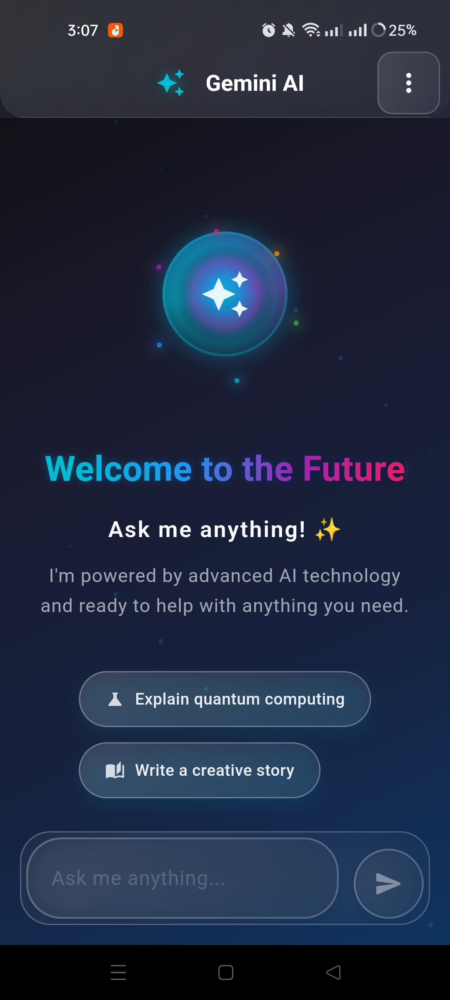
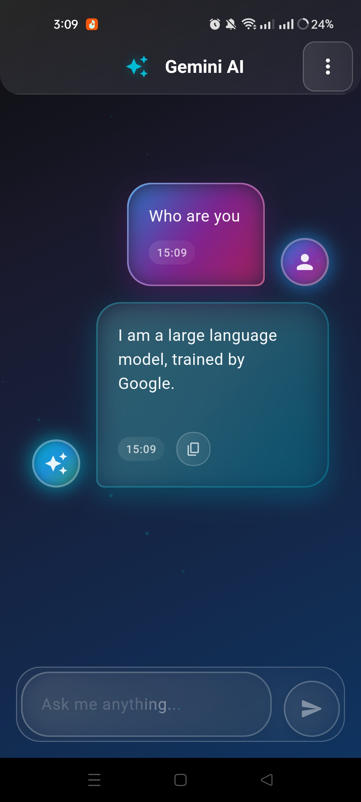
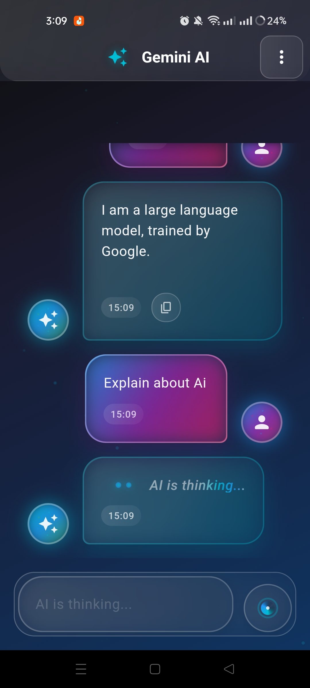
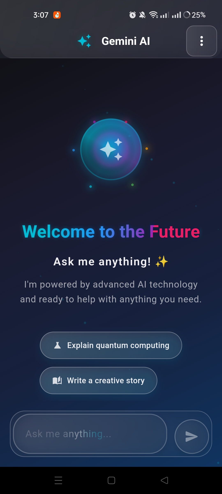

# 🤖 Gemini API Integrated Chat AI

[](https://flutter.dev)
[](https://ai.google.dev/gemini-api)
[](LICENSE)
[](https://opensource.org/)

## 🧠 Overview

**Gemini-API-Integrated Chat AI** is a **next-generation chat application** built with **Flutter** and **Dart**, powered by the **Gemini API** for intelligent and context-aware conversations.  
It provides users with a **modern, responsive**, and **AI-enhanced** chat interface that feels natural, interactive, and engaging.

This project demonstrates the seamless integration of Google's Gemini API into a cross-platform mobile application.

---

## 🚀 Features

- 💬 **AI-Powered Conversations** — Experience realistic and dynamic chats powered by Gemini API.  
- ⚡ **Real-Time Response Rendering** — Smooth streaming of AI responses for a fluid chat experience.  
- 🎨 **Modern UI/UX** — Intuitive and visually appealing interface designed in Flutter.  
- 🌐 **Cross-Platform Support** — Works on Android, iOS, Web, and Desktop.  
- 🧩 **Extensible Architecture** — Easily integrate with additional APIs or expand functionality.  
- 🕶️ **Dark & Light Themes** — Switch seamlessly between themes for better usability.

## 📱 Screenshots
<div align="left">
  <table>
    <tr>
      <td></td>
      <td></td>
      <td></td>
      <td></td>

  </table>
</div>

---

## 🎥 Demo Video

Check out the app in action on **X:**  
👉 [Watch the Demo Here](https://x.com/KishanP07684084/status/1948393335435215355)

You can also share your thoughts or feedback on the post — I’d love to hear what you think! 💬


---

## 🏗️ Tech Stack

| Technology | Description |
|-------------|-------------|
| **Flutter** | Cross-platform UI toolkit for building natively compiled apps |
| **Dart** | Programming language used for app development |
| **Gemini API** | Advanced AI model for natural language understanding and generation |
| **Firebase (optional)** | Can be integrated for authentication, data storage, and analytics |

---

## ⚙️ Installation & Setup

Follow the steps below to set up and run the project locally:

### 1️⃣ Clone the repository
```bash
git clone https://github.com/<your-username>/Gemini-API-Integrated-CHAT-AI.git
cd Gemini-API-Integrated-CHAT-AI
```

### 2️⃣ Install dependencies
```bash
flutter pub get
```

### 3️⃣ Configure Gemini API
```bash
GEMINI_API_KEY=your_api_key_here
```

### 4️⃣ Run the application
```bash
flutter run
```


